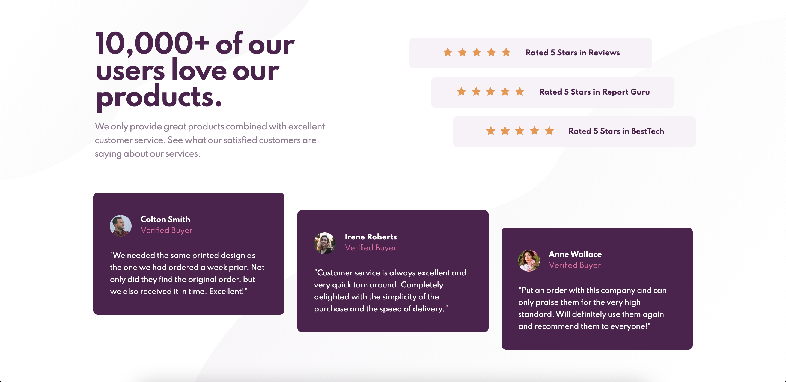

# Frontend Mentor - Social proof section solution

This is a solution to the [Social proof section challenge on Frontend Mentor](https://www.frontendmentor.io/challenges/social-proof-section-6e0qTv_bA). Frontend Mentor challenges help you improve your coding skills by building realistic projects.

## Table of contents

- [Overview](#overview)
  - [The challenge](#the-challenge)
  - [Screenshot](#screenshot)
  - [Links](#links)
- [My process](#my-process)
  - [Built with](#built-with)
  - [What I learned](#what-i-learned)
  - [Continued development](#continued-development)
  - [Useful resources](#useful-resources)
- [Author](#author)
- [Acknowledgments](#acknowledgments)

## Overview

### The challenge

Users should be able to:

- View the optimal layout for the section depending on their device's screen size

### Screenshot

### Links

- Solution URL: [Frontend Mentor](https://your-solution-url.com)
- Live Site URL: [GitHub Pages](https://your-live-site-url.com)

## My process

### Built with

- Semantic HTML5 markup
- Mobile-first workflow
- ARIA Landmark
- CSS custom properties
- Flexbox
- CSS Grid

### What I learned

- Grid
  This challenge I took the time to read through the entire CSS Tricks Complete Guide to Grid before starting. I'm so glad that I did. It made a huge difference and although the layout certainly isn't perfect, it's so much better than my projects in the past.

- Flexbox
  Similar to CSS Grid above, before and during this project I read all of CSS Tricks Guide to Flexbox, and WOW! There are so many things that I didn't realize flexbox could do. It's absolutely incredible, and I'm so glad to have learned more about it.

- Semantic HTML
  Learning more about Semantic HTML before starting this challenge was an absolute game changer. It made all the difference in the way I was able to think about and lay out my project. And I feel SO much better about my HTML for this one. All around, learning a little bit more about Semantic HTML made the biggest improvement for me this time around.

- ARIA
  I started to learn about ARIA. I really want to make sure that I'm doing my best to make my projects accessible moving forward into the future. I have a TON to learn, but I started to during this project.

- Layouts
  I FINALLY feel like I'm starting to get a better grasp of laying things out from the outset. Having a better understanding of all of the above has helped me significantly with this.

- Mobile First
  This is the first project that I took a mobile first approach with, and I'm SO glad that I did. An amazing person in the frontend mentor community suggested that I do this, as well as a few other things. I was hesitant before to try mobile first, because it seemed a little bit backward to my brain. But now that I've done it, I'm not sure that I'll go back to desktop first. I had such a good time with this project. I want to go back and redo all of my projects from the past to include everything that I've learned from this approach, and this project.

### Continued development

- ARIA
- Accessibility
- Semantic HTML
- Layouts
- Grid
- Flexbox

### Useful resources

- [CSS Tricks Flexbox Guide](https://css-tricks.com/snippets/css/a-guide-to-flexbox/#flexbox-properties) - This guide really helped me to get a better grasp of flexbox, and all of the tools it has available at it's disposal. It's unbelievable!
- [CSS Tricks Grid Guide](https://css-tricks.com/snippets/css/complete-guide-grid/) - This guide really helped me to get a better grasp of CSS Grid, and all of the tools it has available at it's disposal. It's unbelievable!
- [ARIA Introduction](https://developer.mozilla.org/en-US/docs/Web/Accessibility/ARIA) - This is an amazing resource which helped me finally start to understand ARIA Landmarks. I'd recommend it to anyone still learning or new to this concept.
- [Semantic HTML](https://www.w3schools.com/html/html5_semantic_elements.asp) - This is the go to if you're new to Semantic HTML. I almost didn't have to use a div during this project, and I really wish I had started learning more about semantic HTML sooner.
- [Responsive Design](https://developer.mozilla.org/en-US/docs/Learn/CSS/CSS_layout/Responsive_Design) - This is a good article with some great information on responsive design and layouts.

## Author

- GitHub - [Brendan Madden](https://github.com/brendanmadden)
- Frontend Mentor - [@brendanmadden](https://www.frontendmentor.io/profile/brendanmadden)
- Twitter - [@BrendanMadden\_](https://www.twitter.com/BrendanMadden_)
